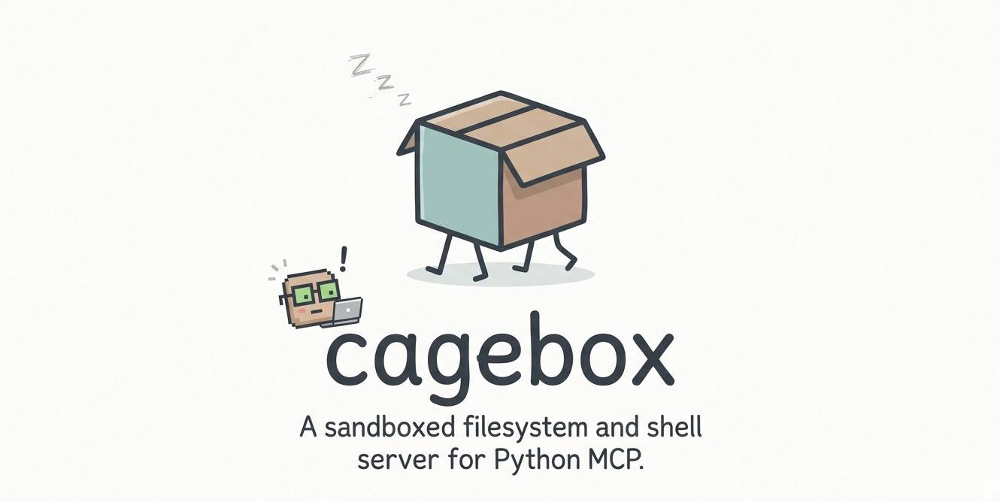

<p align="center">
  
</p>

# cagebox

**cagebox** is a sandboxed filesystem and shell [MCP](https://modelcontextprotocol.io) server. It gives AI agents (Claude, Cursor, VS Code Copilot, etc.) a safe, contained workspace to read files, write files, run shell commands, and more — without ever touching anything outside the designated folder.

Think of it as giving your AI agent its own little box to work in.

---

## How it works

cagebox runs as an HTTP server. Your MCP client connects to it and gets access to a set of file and shell tools. Every operation is path-validated and restricted to the configured workspace directory — the agent cannot escape the box.

```
Your AI Client  ──►  cagebox (HTTP/MCP)  ──►  /workspace  (sandboxed)
```

---

## Quickstart with Docker (recommended)

The easiest way to run cagebox is with Docker. No Python setup needed.

**1. Clone the repo**

```bash
git clone https://github.com/amaghzaz-y/cagebox.git
cd cagebox
```

**2. Start the server**

```bash
docker compose up -d
```

That's it. The server is now running at `http://localhost:8000`.

Your local `./workspace/` folder is mounted into the container — anything the agent reads or writes goes there.

**Stop the server**

```bash
docker compose down
```

### Customizing the workspace path

To use a different folder on your machine, edit `docker-compose.yml`:

```yaml
volumes:
  - /your/custom/path:/workspace
```

### Environment variables

| Variable | Default | Description |
|---|---|---|
| `CAGEBOX_HOST` | `0.0.0.0` | Host the server binds to |
| `CAGEBOX_PORT` | `8000` | Port the server listens on |

---

## Connecting your AI client

Once cagebox is running, point your MCP client at it.

**Claude Desktop** — add to `claude_desktop_config.json`:

```json
{
  "mcpServers": {
    "cagebox": {
      "url": "http://localhost:8000/mcp"
    }
  }
}
```

**VS Code Copilot** — add to `.vscode/mcp.json` in your project:

```json
{
  "servers": {
    "cagebox": {
      "type": "http",
      "url": "http://localhost:8000/mcp"
    }
  }
}
```

**Cursor** — add to `~/.cursor/mcp.json`:

```json
{
  "mcpServers": {
    "cagebox": {
      "url": "http://localhost:8000/mcp"
    }
  }
}
```

---

## Available tools

Once connected, your AI agent can use these tools:

| Tool | Description |
|---|---|
| `read_file` | Read the contents of a file |
| `write_file` | Write or overwrite a file (creates parent directories automatically) |
| `list_dir` | List files and folders in a directory |
| `create_dir` | Create a directory (including nested paths) |
| `delete_file` | Delete a file |
| `move_file` | Move or rename a file |
| `search_files` | Search for files by glob pattern (e.g. `*.py`, `**/*.json`) |
| `stat_file` | Get metadata about a file (size, modified time, etc.) |
| `exec_shell` | Execute a shell command inside the workspace |

All paths are validated — the agent cannot access anything outside the workspace root.

---

## Running locally (without Docker)

If you prefer to run without Docker, you need [uv](https://docs.astral.sh/uv/) installed.

```bash
# Install dependencies
uv sync

# Start the server (serves ./workspace by default)
uv run cagebox

# Or specify a custom workspace path
uv run cagebox /path/to/your/workspace
```

**Options:**

```
uv run cagebox [workspace] [--transport http|stdio] [--host HOST] [--port PORT]
```

| Flag | Default | Description |
|---|---|---|
| `workspace` | `.` | Directory to sandbox the agent in |
| `--transport` | `http` | Use `http` for network clients, `stdio` for local pipe |
| `--host` | `127.0.0.1` | Bind address |
| `--port` | `8000` | Port |

---

## Health check

```bash
curl http://localhost:8000/health
```

Returns `200 OK` when the server is up.

---

## Development

```bash
uv sync
pytest
```

---

## Project structure

```
cagebox/
  main.py        — Server entry point and CLI
  tools.py       — MCP tool definitions
  workspace.py   — Path sandboxing utilities
tests/           — pytest test suite
Dockerfile       — Container image definition
docker-compose.yml
```
